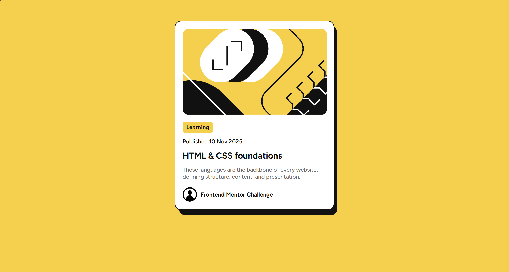

# Frontend Mentor - Blog preview card solution

This is a solution to the [Blog preview card challenge on Frontend Mentor](https://www.frontendmentor.io/challenges/blog-preview-card-ckPaj01IcS).

## Table of contents

- [Frontend Mentor - Blog preview card solution](#frontend-mentor---blog-preview-card-solution)
  - [Table of contents](#table-of-contents)
  - [Overview](#overview)
    - [The challenge](#the-challenge)
    - [Screenshot](#screenshot)
    - [Links](#links)
  - [My process](#my-process)
    - [Built with](#built-with)
    - [Changes from original challenge](#changes-from-original-challenge)
  - [Author](#author)
  - [Acknowledgments](#acknowledgments)

## Overview

### The challenge

Users should be able to:

- hover over the preview box and see a hover animation
- hover over the preview title and see the text color change

### Screenshot

*Screenshot taking on a desktop in OperaGX. Your viewing experience may vary.*

### Links

- Solution URL: [https://github.com/vVvOvOvVv/blog-preview-card-main](https://github.com/vVvOvOvVv/blog-preview-card-main)
- Live Site URL: [https://v-blog-preview-card.netlify.app](https://v-blog-preview-card.netlify.app)

## My process

### Built with

- [Vue.js](https://vuejs.org) (Options API)
- [npm](https://www.npmjs.com)
- HTML

### Changes from original challenge

- hover animation
- "author" of the preview changed to a more generic author
- profile picture of said author changed to a more generic one
- may have some minor spacing differences

## Author

- Dev Portfolio & Website - [V's Portfolio](https://vvvovovvv.github.io)

## Acknowledgments

Resources and assets used in this project were provided by [Frontend Mentor](https://www.frontendmentor.io/challenges/blog-preview-card-ckPaj01IcS). This is otherwise a solo project.
